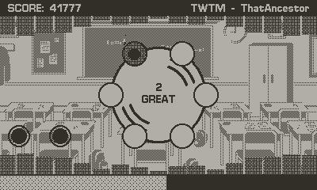
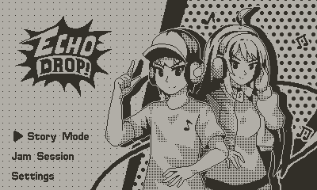
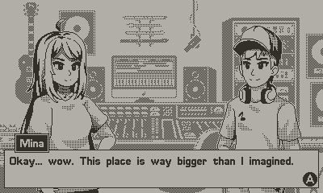
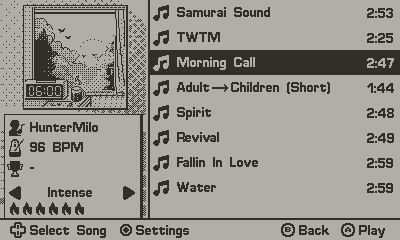
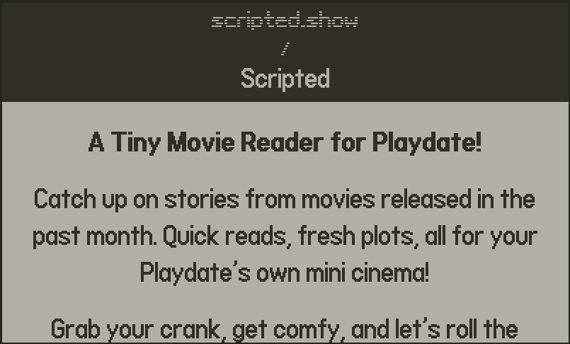
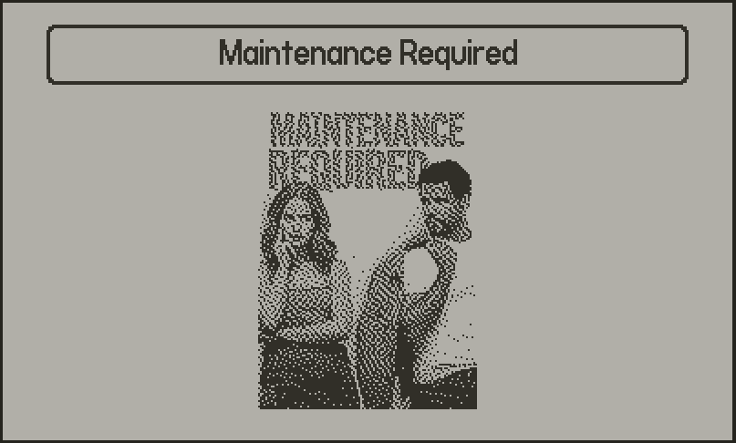
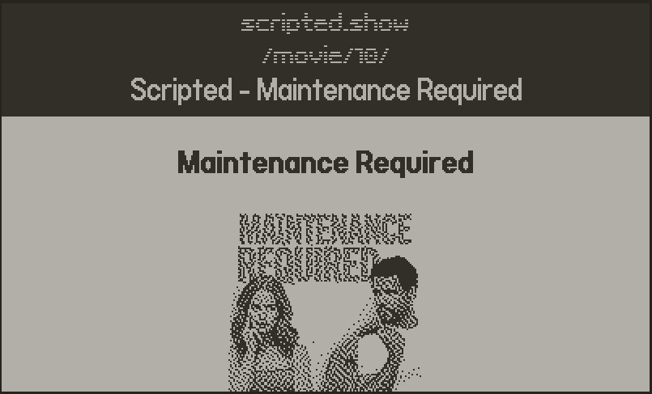
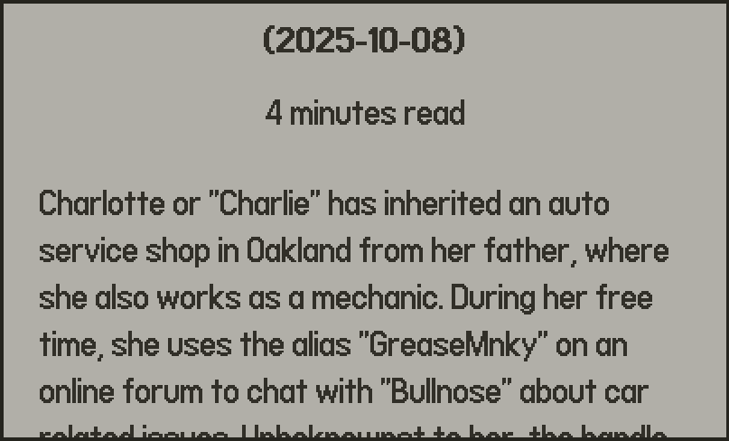

# Hi there 👋, I'm [Vincentius Madya](https://www.linkedin.com/in/vincentius-madya/)

- Senior Software Engineer in foodpanda 🐼
- Based in Singapore 🇸🇬
- I play and make games 🎮

# 🎮 Playdate Projects

Join <b>Mina</b> and <b>Kai</b> on their exciting journey to become great DJs! Starting from a humble school performance, playing in cozy cafes, and showcasing their talent along the way.

    

<table style="border-collapse: collapse; border: none;">
  <tr>
    <td style="border: none;"></td>
    <td style="border: none;"></td>
  </tr>
  <tr>
    <td style="border: none;"></td>
    <td style="border: none;"></td>
  </tr>
</table>

...

<b>Lights. Camera. Playdate!</b> Experience the stories behind the silver screen, one plot at a time. Scripted brings the magic of cinema to your Playdate through the Constellation Browser.

<b>Visit   https://scripted.show/ </b>

<table>
  <tr>
    <td></td>
    <td></td>
  </tr>
  <tr>
    <td></td>
    <td></td>
  </tr>
</table>

