# Hi there 👋, I'm [Vincentius Madya](https://www.linkedin.com/in/vincentius-madya/)

- Senior Software Engineer in foodpanda 🐼
- Based in Singapore 🇸🇬
- I play and make games 🎮

 

# 🎮 Gamedev Projects

    

Join <b>Mina</b> and <b>Kai</b> on their exciting journey to become great DJs! Starting from a humble school performance, playing in cozy cafes, and showcasing their talent along the way.

    

  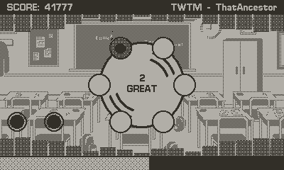&nbsp;&nbsp;
  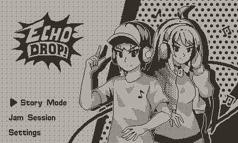&nbsp;&nbsp;
  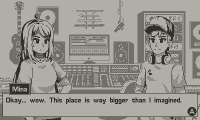&nbsp;&nbsp;
  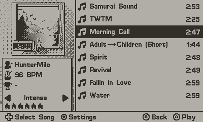

---

    

Be prepared to handle the cuteness of Roojack world. Help <b>Maple</b> and <b>Whippy</b> to prove that one of the urban legends from Roojack was right. Legend says that a treasure was hidden somewhere. In that treasure, there exists something so powerful that it can conquer the world

    

    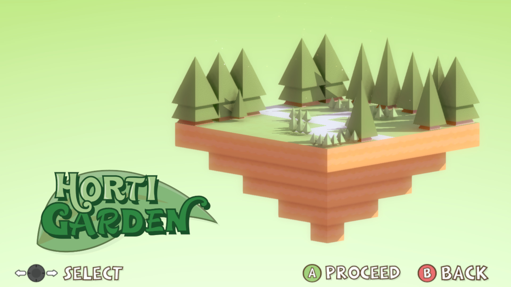
    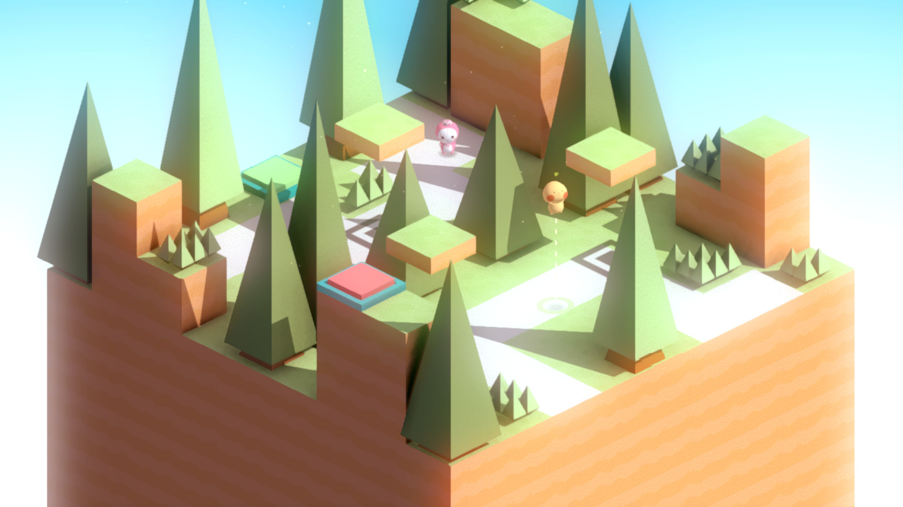
    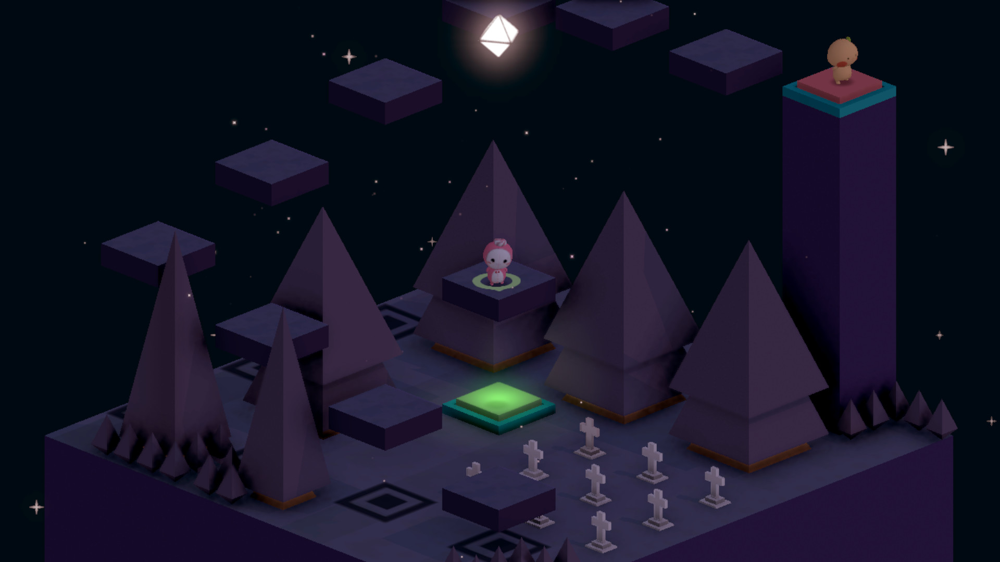
    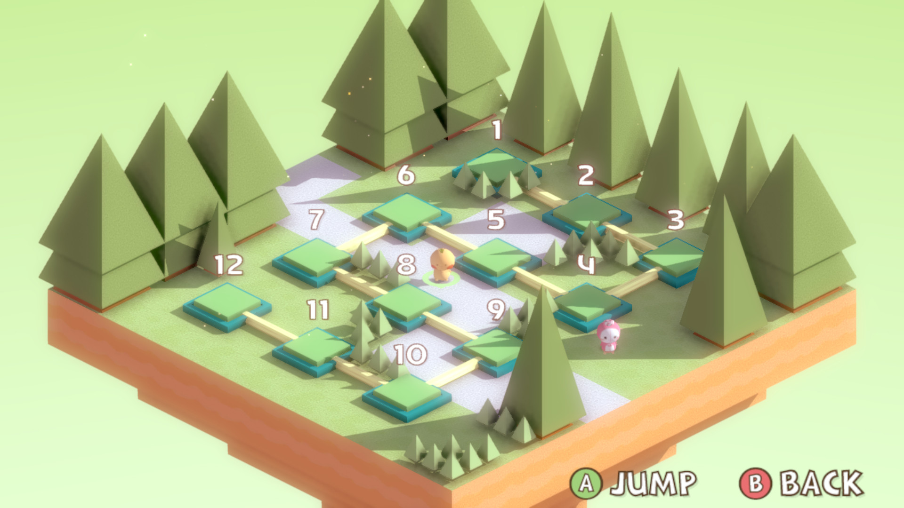

---

    

This is the collection of the Arduboy games that I made over a couple of years. You can play these games directly from your Arduboy by compiling the source code below or buy the <a target="_blank" href="https://www.arduboy.com/">Arduboy FX</a> that has 200 games in it, including these four awesome games 😉.

    

    
    
    
    

---

    

<b>Lights. Camera. Playdate!</b> Experience the stories behind the silver screen, one plot at a time. Scripted brings the magic of cinema to your Playdate through the Constellation Browser.

<b>Visit   https://scripted.show/ </b>

    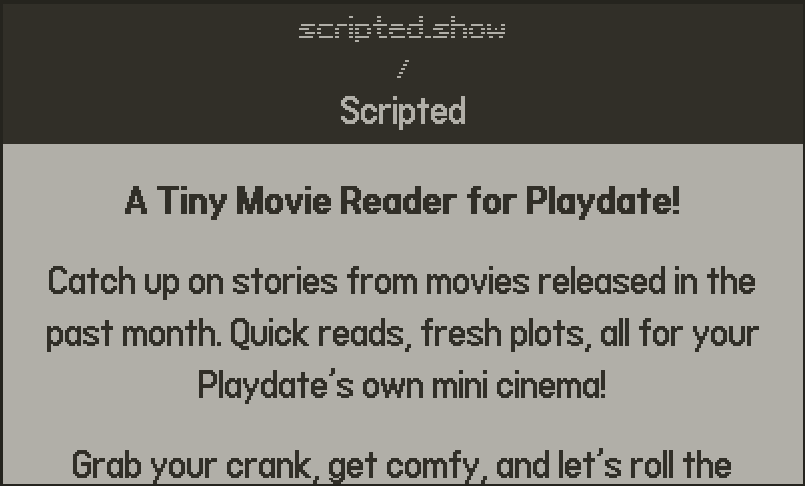
    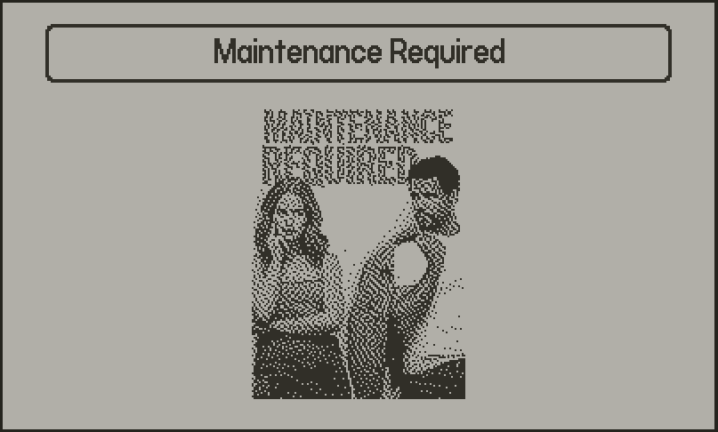
    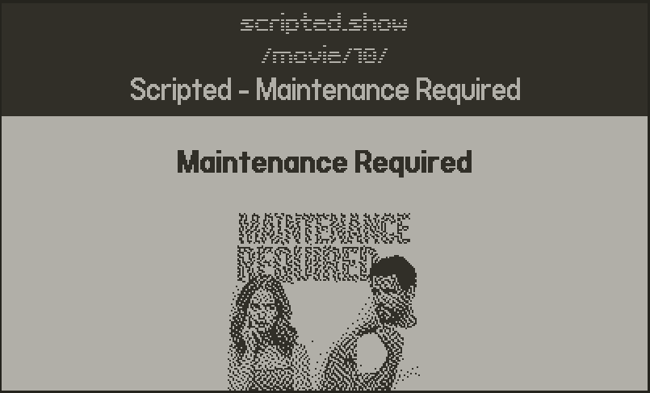
    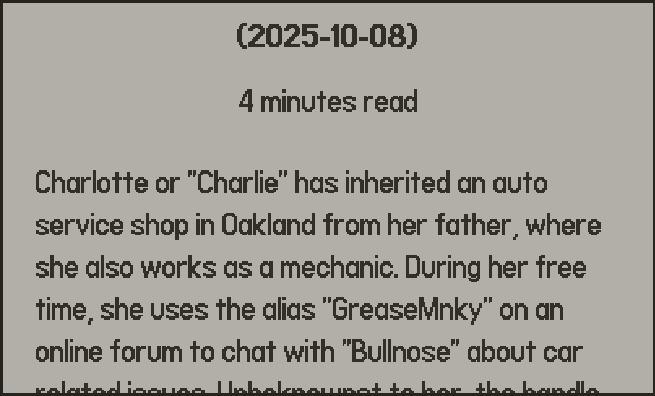

